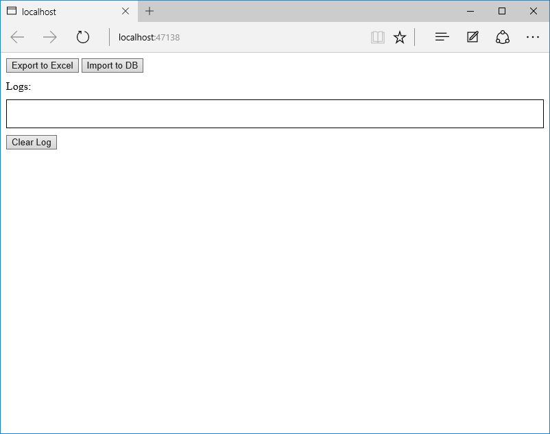
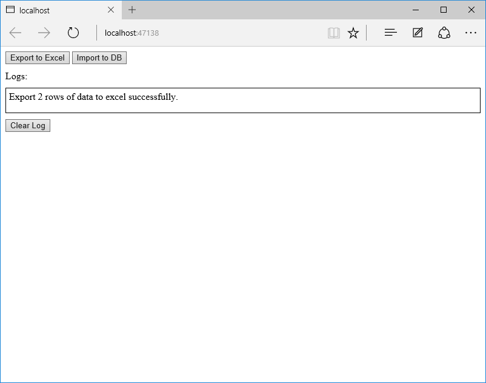
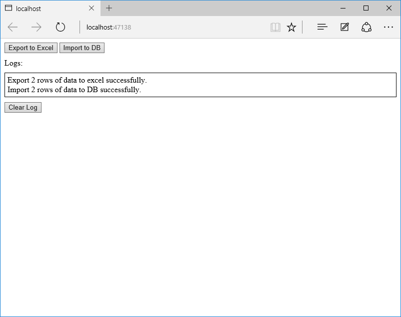

# storage-blobs-dotnet-export-import-excel-blob-to-from-db
This sample demonstrates how to import the worksheet Azure Excel file blob to DB on the Azure SQL Server and how to export from DB to Azure Excel blob.
## Running this sample
Do one of the following to start debugging:                                                                              
• Click the Start Debugging button on the toolbar.                                                                                 
• Click Start Debugging in the Debug menu.                                                                                  
• Press F5.    
                                                                       
You will see this page:  

        
                                                                          
Click button “Export to Excel”:      
  
      
                                                         
Click button “Import to DB”      
                                                                              
 

You can click the button “Clear Log” to clear the logs.                                                     
## About the code
Before you build the project, make sure you have installed WindowsAzure.Storage package in the project.                                                 
The following steps can help you to install it:                                                                                   
Open the solution CSWebAppAzureExcelImportExport.sln.                                                                            
Right click the project and select [Manage NuGet Packages…].                                                                                 
Search WindowsAzure.Storage at the Browse tab page. Find the right package and then install it.                                                      

You also need to set your Azure information in Helper.cs file:
```cs
StorageCredentials cred = new StorageCredentials("[Your storage account name]", "[Your storage account key]"); 
CloudBlobContainer container = new CloudBlobContainer(new Uri("http://[Your storage account name].blob.core.windows.net/[Your container name] /"), cred); 
string connectionStr = "Azure SQL Server Connection String";
```
Run CreateTable.sql in the SQLScripts folder on your Azure SQL Server DB to create the test table and test data. Otherwise, you can set your data table info first in Helper.cs file if you want to test your own data:
```cs
List<string> columns = new List<string>() { "{column1}”, "{column2}", "{column3}"}; 
string tableName = "{table name}";
```
## More information
For more information about Open XML, see <https://msdn.microsoft.com/en-us/library/office/bb456488.aspx>                                                        
About Azure SQL Database development, see <https://azure.microsoft.com/en-us/documentation/articles/sql-database-develop-overview/>                                    
To learn more about SqlBulkCopy class, see <https://msdn.microsoft.com/en-us/library/system.data.sqlclient.sqlbulkcopy(v=vs.110).aspx>